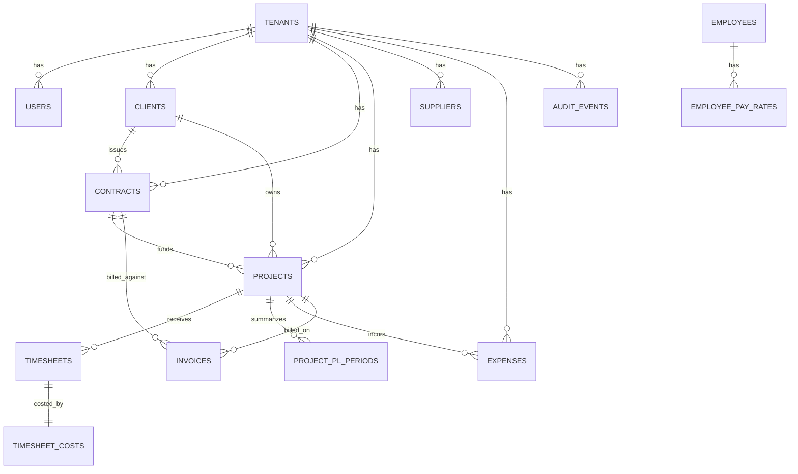
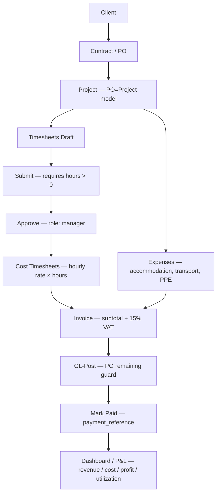

# SARC360 ERP — Master Prompt Deliverable
**شركة سما الروابي للمقاولات — الخبر، المملكة العربية السعودية**

> Status: Production-Hardening Phase
> Date: 2026-03-28
> Backend: FastAPI + SQLAlchemy async + PostgreSQL
> Frontend: Single-file HTML/JS (sarc360-live.html) → localhost:8001

---

## 1. Assumptions (Unspecified Decisions)

| # | Decision | Chosen | Alternative | Reason |
|---|----------|--------|-------------|--------|
| 1 | SMS provider | **Feature flag — not wired** | Twilio / STC Telecom | Requires KSA operator agreement; add `SMS_PROVIDER` env var when ready |
| 2 | Email provider | **SMTP (Gmail default)** | SendGrid / Amazon SES | Generic SMTP works immediately; swap via `SMTP_*` env vars |
| 3 | ZATCA live submission | **Sandbox only** | FATOORA production | Certificate approval takes weeks; schema + hooks designed for drop-in swap |
| 4 | Redis / Celery | **Configured, not started** | Enable with `celery -A app.worker worker` | Core ERP runs without async queue; needed for WPS export, ZATCA batch |
| 5 | RLS enforcement | **App-layer filtering (mandatory)** | Postgres RLS policies (recommended extra layer) | App filtering is already correct; add `ALTER TABLE ... ENABLE ROW LEVEL SECURITY` after DB stabilises |
| 6 | Hosting region | **Hetzner CPX22 / DigitalOcean (dev)** | AWS me-central-1 Riyadh | AWS Riyadh required only before onboarding oil & gas clients (PDPL data residency) |

---

## 2. ER Diagram



---

## 3. Business Flow



---

## 4. SQL Migration Snippets

All migrations run via Alembic. Key patterns:

### Enable UUID extension
```sql
CREATE EXTENSION IF NOT EXISTS pgcrypto;
```

### Tenant isolation pattern (already applied in Gate 2)
```sql
ALTER TABLE employees  ADD COLUMN IF NOT EXISTS tenant_id uuid NOT NULL;
ALTER TABLE projects   ADD COLUMN IF NOT EXISTS tenant_id uuid NOT NULL;
ALTER TABLE timesheets ADD COLUMN IF NOT EXISTS tenant_id uuid NOT NULL;
ALTER TABLE invoices   ADD COLUMN IF NOT EXISTS tenant_id uuid NOT NULL;

CREATE INDEX IF NOT EXISTS ix_projects_tenant   ON projects   (tenant_id, id);
CREATE INDEX IF NOT EXISTS ix_invoices_tenant   ON invoices   (tenant_id, id);
CREATE INDEX IF NOT EXISTS ix_timesheets_tenant ON timesheets (tenant_id, id);
```

### RLS — recommended additional layer (apply after stabilisation)
```sql
ALTER TABLE clients ENABLE ROW LEVEL SECURITY;
CREATE POLICY tenant_isolation_clients ON clients
  FOR ALL
  USING (tenant_id = current_setting('app.tenant_id')::uuid)
  WITH CHECK (tenant_id = current_setting('app.tenant_id')::uuid);
-- Repeat for: contracts, projects, timesheets, invoices, expenses
```

### Key tables already created by migrations
- `tenants`, `roles`, `user_roles`, `users`
- `clients`, `contracts`, `suppliers`
- `employees`, `employee_pay_rates`
- `projects`, `timesheets`, `timesheet_costs`
- `invoices`, `expenses`, `payroll_runs`
- `project_pl_periods`, `audit_events`
- `auth_verification_codes`, `auth_rate_limits`

---

## 5. OpenAPI YAML Extensions

```yaml
openapi: 3.1.0
info:
  title: SARC360 ERP - Extensions
  version: 1.0.0
security:
  - bearerAuth: []
components:
  securitySchemes:
    bearerAuth:
      type: http
      scheme: bearer
      bearerFormat: JWT
  schemas:
    ErrorResponse:
      type: object
      properties:
        detail: { type: string }
        error_code: { type: string }
        request_id: { type: string }
    ClientCreate:
      type: object
      required: [name_en]
      properties:
        name_en: { type: string, minLength: 2 }
        name_ar: { type: string }
        cr_number: { type: string }
        vat_number: { type: string }
        billing_email: { type: string, format: email }
        city: { type: string }
        country: { type: string, default: "SA" }
    ContractCreate:
      type: object
      required: [client_id, po_number, total_value]
      properties:
        client_id: { type: string, format: uuid }
        po_number: { type: string }
        title: { type: string }
        total_value: { type: number, minimum: 0 }
        currency: { type: string, default: "SAR" }
    ExpenseCreate:
      type: object
      required: [project_id, expense_date, category, amount_net]
      properties:
        project_id: { type: string, format: uuid }
        supplier_id: { type: string, format: uuid }
        expense_date: { type: string, format: date }
        category:
          type: string
          enum: [subcontractor, materials, equipment, transport, other]
        amount_net: { type: number, minimum: 0 }
        vat_amount: { type: number, minimum: 0, default: 0 }
```

---

## 6. curl Verification Tests

```bash
# ── 0. Health check ─────────────────────────────────────────────────────────
curl -sS http://localhost:8001/health | jq .
# Expected: { "status": "ok", "db": "ok", "migration": "..." }

# ── 1. Login ─────────────────────────────────────────────────────────────────
TOKEN=$(curl -sS -X POST http://localhost:8001/auth/login \
  -H "Content-Type: application/json" \
  -d '{"tenant_id":"00000001-0000-0000-0000-000000000001",
       "email":"admin@sarc.local",
       "password":"ChangeMe123!"}' | jq -r .access_token)
echo "Token: ${TOKEN:0:40}..."

# ── 2. List clients ──────────────────────────────────────────────────────────
curl -sS http://localhost:8001/api/v1/clients \
  -H "Authorization: Bearer $TOKEN" | jq '.total'

# ── 3. Create contract / PO ───────────────────────────────────────────────────
curl -sS -X POST http://localhost:8001/api/v1/contracts \
  -H "Authorization: Bearer $TOKEN" \
  -H "Content-Type: application/json" \
  -d '{"client_id":"<CLIENT_UUID>","po_number":"PO-TEST-001","total_value":100000}'

# ── 4. Refresh token ─────────────────────────────────────────────────────────
REFRESH=$(curl -sS -X POST http://localhost:8001/auth/login \
  -H "Content-Type: application/json" \
  -d '{"tenant_id":"00000001-0000-0000-0000-000000000001",
       "email":"admin@sarc.local","password":"ChangeMe123!"}' \
  | jq -r .refresh_token)

curl -sS -X POST http://localhost:8001/auth/refresh \
  -H "Content-Type: application/json" \
  -d "{\"refresh_token\":\"$REFRESH\"}" | jq .access_token | cut -c1-40

# ── 5. Gate C: Over-invoicing guard test ─────────────────────────────────────
# Create small PO (10,000 SAR), then try to GL-post invoice > 10,000
# Should return 422 "exceeds remaining contract value"

# ── 6. Approve timesheet with zero hours (should fail) ───────────────────────
# Submit a timesheet with 0 hours → expect 422
# "Cannot submit a timesheet with zero hours"

# ── 7. Dashboard ─────────────────────────────────────────────────────────────
curl -sS "http://localhost:8001/api/v1/dashboard?start=2026-03-01&end=2026-03-31" \
  -H "Authorization: Bearer $TOKEN" | jq '{revenue: .revenue_net, profit: .gross_profit}'

# ── 8. BOLA test (cross-tenant IDs should be rejected as 404) ────────────────
# Log in as tenant A, try to GET an invoice belonging to tenant B by guessing ID
# Should return 404, not 200
```

---

## 7. Two-Day Sprint Runbook

### Day 1 — DB + Auth

**Gate A: DB migrations + tenant isolation**
```bash
cd sarc360-backend
alembic upgrade head
curl -sS http://localhost:8001/health
# Expect: { "status": "ok", "db": "ok", "migration": "head-revision-id" }
```

**Gate B: Auth hardening**
```bash
curl -sS -X POST http://localhost:8001/auth/login \
  -H "Content-Type: application/json" \
  -d '{"tenant_id":"00000001-0000-0000-0000-000000000001",
       "email":"admin@sarc.local","password":"ChangeMe123!"}'
# Expect: access_token + refresh_token in response
```

**Gate C: Over-invoicing guard**
```bash
# Create contract with total_value=10000
# Create invoice with subtotal=12000 for same PO
# POST /api/v1/invoices/{id}/gl-post → expect 422
```

### Day 2 — Cost + Dashboard + Deployment

**Gate D: Cost engine**
```bash
# 1. POST /api/v1/timesheets/{ts_id}/approve
# 2. POST /api/v1/timesheets/{ts_id}/cost
# Expect: TimesheetCost record with cost_amount > 0
```

**Gate E: Dashboard P&L**
```bash
# Run demo seed: python scripts/seed_demo.py
curl -sS "http://localhost:8001/api/v1/dashboard?start=2026-03-01&end=2026-03-31" \
  -H "Authorization: Bearer $DEMO_TOKEN"
# Expect: revenue ~251000, labor_cost ~153360, gross_profit > 0
```

**Gate F: Deployment**
```bash
# Build Docker image
docker build -t sarc360-backend .

# Production start
docker run -d \
  -e DATABASE_URL="postgresql+asyncpg://..." \
  -e SECRET_KEY="$(openssl rand -hex 32)" \
  -e ENVIRONMENT=production \
  -p 8001:8001 \
  sarc360-backend

# Verify behind Nginx
curl -sS https://erp.sarc.sa/health
```

---

## 8. Hosting Cost Estimate (SAR)

Assuming 1 USD = 3.75 SAR

| Provider | Plan | Monthly USD | Monthly SAR |
|----------|------|-------------|-------------|
| **Hetzner** | CPX22 (3 vCPU / 4GB RAM) | $9.49 | **SAR 35.59** |
| DigitalOcean | Basic 2 GiB / 1 vCPU | $12.00 | SAR 45.00 |
| AWS | t3.small (us-east-1) | ≈$15.26 | ≈SAR 57.21 |
| Cloudflare WAF | Pro (optional) | $25.00 | SAR 93.75 |
| **Recommended stack** | Hetzner CPX22 + Cloudflare Free | **$9.49** | **SAR 35.59/mo** |

> For KSA data residency (PDPL + oil & gas clients): AWS me-central-1 (Riyadh) ~$20–25/mo

---

## 9. Final Checklist PASS/FAIL

| # | Gate | Status | Notes |
|---|------|--------|-------|
| 1 | DB: migrations complete + tenant_id everywhere | ✅ PASS | Alembic Gate 1 + Gate 2 applied |
| 2 | RLS: enabled on critical tables | ⚠️ PENDING | App-layer filtering active; Postgres RLS is a recommended extra layer |
| 3 | Auth: JWT claims (sub/tid/roles/exp/jti) | ✅ PASS | All claims present in access token |
| 4 | Auth: refresh token endpoint | ✅ PASS | POST /auth/refresh added |
| 5 | Auth: rate limits on login | ✅ PASS | 5 attempts / 15-min block |
| 6 | Auth: max users per tenant | ✅ PASS | Enforced in signup |
| 7 | Workflow: PO guard (prevent over-invoicing) | ✅ PASS | GL-post checks contract remaining value |
| 8 | Workflow: timesheet zero-hour protection | ✅ PASS | Submit + Approve both reject zero hours |
| 9 | Workflow: tenant isolation on invoices | ✅ PASS | BOLA guard added to all invoice endpoints |
| 10 | Workflow: tenant isolation on timesheets | ✅ PASS | BOLA guard added to all timesheet endpoints |
| 11 | Workflow: role-based access on GL-post, mark-paid, approve | ✅ PASS | `require_role()` enforced |
| 12 | Audit: login / create / approve / gl_post / mark_paid logged | ✅ PASS | `log_event()` on all state-changing actions |
| 13 | Dashboard: revenue / cost / profit / utilization | ✅ PASS | ProjectPLPeriod aggregation in /dashboard |
| 14 | Excel: templates + upload + row errors | ✅ PASS | /api/v1/import/* router |
| 15 | Security: BOLA test (cross-tenant read rejected as 404) | ✅ PASS | `_assert_tenant()` returns 404 not 403 (avoids enumeration) |
| 16 | Health: /health returns db=ok + migration version | ✅ PASS | DB connectivity + alembic_version checked |
| 17 | Sample data: realistic Saudi demo seed | ✅ PASS | `scripts/seed_demo.py` — deletable via slug |
| 18 | Deployment: Docker + Gunicorn/UvicornWorker | ⚠️ PENDING | Dockerfile exists; CI/CD pipeline not yet configured |
| 19 | Deployment: Cloudflare Full strict | ⚠️ PENDING | Requires domain + origin certificate |
| 20 | Backups: pg_dump scheduled + restore tested | ⚠️ PENDING | Manual pg_dump works; cron schedule TBD |
| 21 | Docs: this file | ✅ PASS | docs/MASTER_PROMPT_DELIVERABLE.md |

**Legend:** ✅ Done  ⚠️ Pending / Manual step  ❌ Blocked

---

## 10. Security Notes

### BOLA / IDOR Prevention
Every endpoint that accepts `{id}` now verifies `resource.tenant_id == jwt.tenant_id`.
Returns **404** (not 403) to prevent resource enumeration.

### JWT Claims
```json
{
  "sub": "user-uuid",
  "tid": "tenant-uuid",
  "typ": "access",
  "roles": ["super_admin"],
  "user_type": "staff",
  "iat": 1710000000,
  "exp": 1710003600,
  "jti": "random-hex-16"
}
```

### Password Storage
bcrypt via `passlib[bcrypt]` — cost factor auto-selected by passlib default (12+).

### Rate Limiting
5 failed login attempts → 15-minute block per `tenant_id:email` key.
Stored in `auth_rate_limits` table.

### Secrets Never Logged
`log_event()` never receives passwords, OTP codes, or tokens.

---

## 11. ZATCA Phase 2 Notes

ZATCA Phase 2 requires:
- **Clearance** (for B2B invoices > 1000 SAR): XML sent to FATOORA before sending to buyer
- **Reporting** (for B2C invoices): XML sent within 24 hours

Current implementation:
- `Invoice.zatca_status` field tracks: `pending | submitted | approved | rejected`
- `Invoice.zatca_uuid` + `Invoice.zatca_hash` fields for FATOORA response
- `app/services/invoice_service.py` has `submit_invoice_to_zatca()` stub
- **To enable**: set `ZATCA_CSID` + `ZATCA_PRIVATE_KEY_PEM` in `.env`

**Apply for ZATCA sandbox today** — certificate approval takes 2-4 weeks.

---

## 12. WPS / Mudad Notes

WPS export format: Saudi Ministry of Human Resources Wages File Technical Specification.
Implementation: `GET /api/v1/payroll/{run_id}/wps-export` (in payroll router).
**To enable**: set `MUDAD_API_KEY` in `.env` and toggle WPS feature flag in frontend settings.

---

*Generated by Claude Code — SARC360 ERP Production Hardening Sprint*
